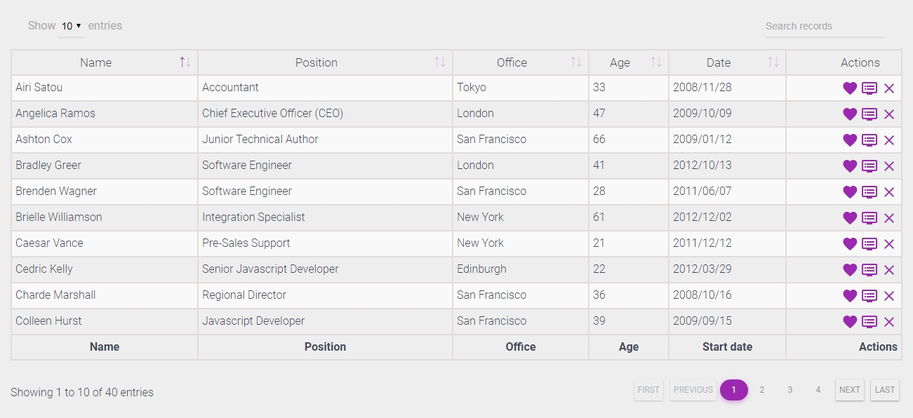
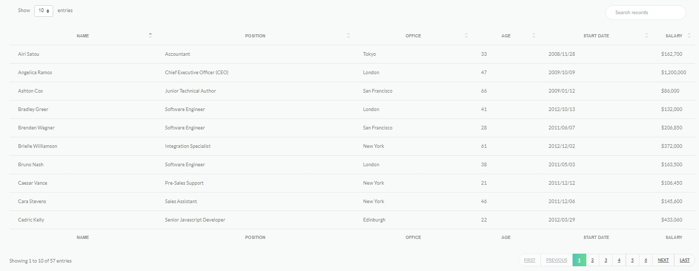
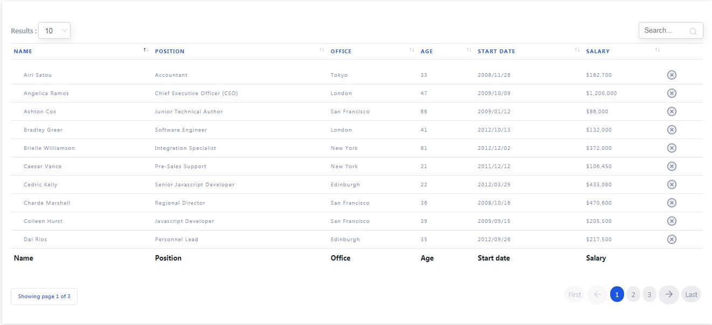
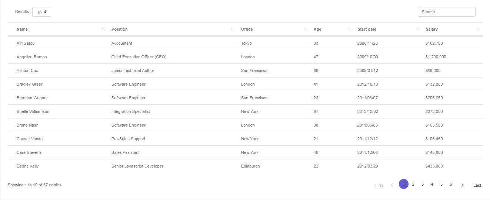
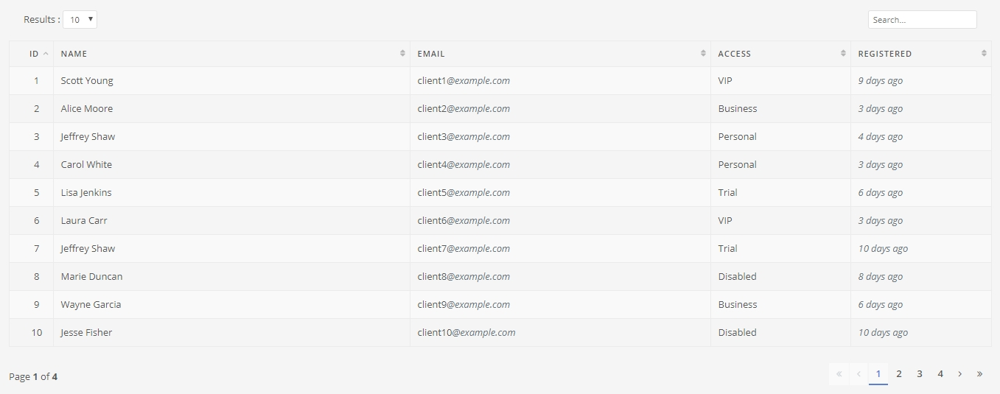

### Things to note

- These libraries are required, they are bundled together by default (can exclude any of it in ***webpack config***):
 - [jquery](https://www.npmjs.com/package/jquery)
 - [datatables.net](https://www.npmjs.com/package/datatables.net)
 - [datatables.net-bs4](https://www.npmjs.com/package/datatables.net-bs4)
 - [datatables.net-responsive](https://www.npmjs.com/package/datatables.net-responsive)
- If any of ***the above*** is excluded in the bundle, the external library(s) must be included separately

----

# css-datatables


###Examples

<p style="text-align: center; text-decoration:underline; font-size:2rem; font-weight:bold">[DEMO](https://mereka-ta.github.io/css-datatables)</p>

Theme-1:



Theme-2:



Theme-3:



Theme-4:



Theme-5:



----

###Usage

####Include the script

`<script type="text/javascript" src="https://gitcdn.xyz/repo/mereka-ta/css-datatables/master/dist/theme-1/jquery.dataTables.min.js"></script>`

There are 5 variations of the styles. Simply rename the `theme-1` in the path to either `theme-2`, `theme-3`, `theme-4` or `theme-5`

* *this method is for direct use. If bundled with any changes, the script must be included locally*

####HTML

```html
...
...
	<table id="datatables">
		<thead>
			<tr>
				<th>Name</th>
				<th>Position</th>
				<th>Office</th>
				<th>Age</th>
			</tr>
		</thead>
		<tbody>
			<tr>
				<td class="icon-details">Tiger Nixon</td>
				<td>System Architect</td>
				<td>Edinburgh</td>
				<td>61</td>
			</tr>
			<tr>
				<td class="icon-details">Garrett Winters</td>
				<td>Accountant</td>
				<td>Tokyo</td>
				<td>63</td>
			</tr>
			<tr>
				<td class="icon-details">Ashton Cox</td>
				<td>Junior Technical Author</td>
				<td>San Francisco</td>
				<td>66</td>
			</tr>
		</tbody>
	</table>
...
...
```

####Javascript

```javascript
...
...
$('#datatables').DataTable({
	initCompleteThen: function(dt) {
		console.log('done init');
	},
	drawCallbackThen: function(dt) {
		console.log('redrawn');
	}
});
...
...
```

More options: [DataTables Options](https://datatables.net/reference/option/)

----

###Custom Bundle (Webpack 4)

Make changes & bundle locally:

1. Clone this repo
2. `$ cd path/of/the/repo`
3. `$ npm install`
4. Edit in "webpack.bundle.config.js" and "/src/theme-`1`|`2`|`3`|`4`|`5`"
5. Start bundle by specifying `--theme=` `1` | `2` | `3` | `4` | `5` :
	`$ npm run bundle --theme=1`
6. Bundled files are in directory "/dist/theme-`1`|`2`|`3`|`4`|`5`"


----